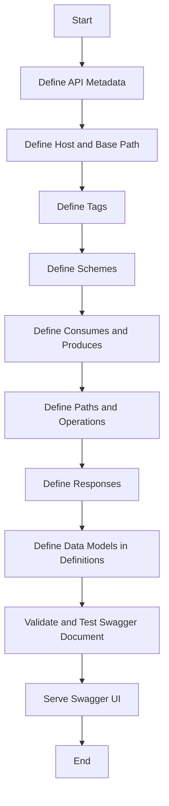
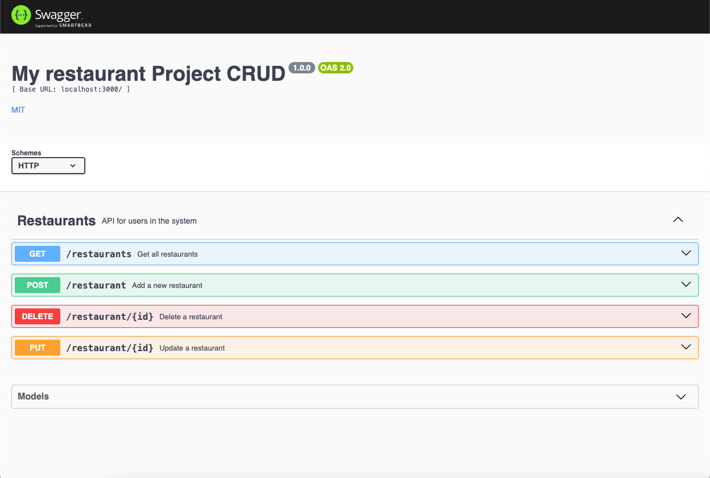

# API Documentation Process Using Swagger


## Table of Contents
1. [Flowchart](#flowchart)
2. [Steps to Create Swagger JSON](#steps-to-create-swagger-json)
    1. [Define API Metadata](#1-define-api-metadata)
    2. [Define Host and Base Path](#2-define-host-and-base-path)
    3. [Define Tags](#3-define-tags)
    4. [Define Schemes](#4-define-schemes)
    5. [Define Consumes and Produces](#5-define-consumes-and-produces)
    6. [Define Paths and Operations](#6-define-paths-and-operations)
    7. [Define Responses](#7-define-responses)
    8. [Define Data Models in Definitions](#8-define-data-models-in-definitions)
    9. [Validate and Test Swagger Document](#9-validate-and-test-swagger-document)
    10. [Serve Swagger UI](#10-serve-swagger-ui)
3. [Example using Swagger JSDoc](#example-using-swagger-jsdoc)
4. [Running the Project](#running-the-project)

## Flowchart



## Steps to Create Swagger JSON

### 1. Define API Metadata
**API metadata** provides essential information about the API, such as its version, title, description, and licensing details. This information helps users understand the purpose and scope of the API. Metadata is crucial for documentation and helps in maintaining and versioning the API. It includes:

- **Version**: Indicates the version of the API.
- **Title**: The name of the API.
- **Description**: A brief description of what the API does.
- **License**: Information about the licensing of the API.

For this project, the metadata is defined as follows:

```json
{
  "swagger": "2.0",
  "info": {
    "version": "1.0.0",
    "title": "My restaurant Project CRUD",
    "description": "My User Project Application API",
    "license": {
      "name": "MIT",
      "url": "https://opensource.org/licenses/MIT"
    }
  }
}
```

### 2. Define Host and Base Path
The **host** and **base path** specify the root URL for the API. The host is the domain name or IP address where the API is hosted, and the base path is the initial path segment of the API. This information is necessary for clients to know where to send their requests. It includes:

- **Host**: The domain or IP address of the API server.
- **Base Path**: The initial path segment for all API endpoints.

For this project, the host and base path are defined as follows:

```json
{
  "host": "localhost:3000",
  "basePath": "/"
}
```

### 3. Define Tags
**Tags** are used to categorize API endpoints. They help organize the API documentation by grouping related endpoints together, making it easier for users to navigate. Tags improve the readability and usability of the API documentation. It includes:

- **Name**: The name of the tag.
- **Description**: A brief description of what the tag represents.

For this project, the tags are defined as follows:

```json
{
  "tags": [
    {
      "name": "Restaurants",
      "description": "API for users in the system"
    }
  ]
}
```

### 4. Define Schemes
**Schemes** specify the protocols supported by the API, such as HTTP or HTTPS. This information is crucial for clients to know how to interact with the API securely. Defining schemes ensures that the API can be accessed over the correct protocol. It includes:

- **Schemes**: An array of supported protocols (e.g., `http`, `https`).

For this project, the schemes are defined as follows:

```json
{
  "schemes": [
    "http"
  ]
}
```

### 5. Define Consumes and Produces
The **consumes** and **produces** fields indicate the content types the API can accept and return. This helps clients understand the format of the data they need to send and can expect to receive. Properly defining these fields ensures compatibility between the client and server. It includes:

- **Consumes**: An array of MIME types the API can consume (e.g., `application/json`).
- **Produces**: An array of MIME types the API can produce (e.g., `application/json`).

For this project, the consumes and produces fields are defined as follows:

```json
{
  "consumes": [
    "application/json"
  ],
  "produces": [
    "application/json"
  ]
}
```

### 6. Define Paths and Operations
**Paths and operations** define the endpoints of the API and the HTTP methods (e.g., GET, POST) that can be used to interact with them. Each operation includes details such as parameters, request bodies, and responses. This section is the core of the API documentation, providing detailed information on how to use each endpoint. It includes:

- **Paths**: The endpoints of the API.
- **Operations**: The HTTP methods and their details for each endpoint.

For this project, the paths and operations are defined as follows:

```json
{
  "paths": {
    "/restaurants": {
      "get": {
        "tags": [
          "Restaurants"
        ],
        "summary": "Get all restaurants",
        "description": "Get all restaurants",
        "operationId": "getRestaurants",
        "produces": [
          "application/json"
        ],
        "responses": {
          "200": {
            "description": "successful operation",
            "schema": {
              "type": "array",
              "items": {
                "$ref": "#/definitions/Restaurant"
              }
            }
          },
          "400": {
            "description": "Invalid status value"
          }
        }
      }
    }
  }
}
```

### 7. Define Responses
**Responses** specify the possible outcomes of an API operation, including status codes and response schemas. This helps clients understand what to expect when they make a request. Defining responses ensures that clients can handle different outcomes appropriately. It includes:

- **Status Codes**: The HTTP status codes returned by the API.
- **Description**: A brief description of each response.
- **Schema**: The structure of the response data.

For this project, the responses are defined as follows:

```json
{
  "responses": {
    "200": {
      "description": "successful operation",
      "schema": {
        "type": "array",
        "items": {
          "$ref": "#/definitions/Restaurant"
        }
      }
    },
    "400": {
      "description": "Invalid status value"
    }
  }
}
```

### 8. Define Data Models in Definitions
**Data models** define the structure of the data used in the API. They are specified in the `definitions` section and can be referenced throughout the API documentation. Defining data models ensures consistency and reusability of data structures. It includes:

- **Definitions**: The data models used in the API.
- **Properties**: The attributes of each data model.
- **Required**: The required attributes for each data model.

For this project, the data models are defined as follows:

```json
{
  "definitions": {
    "Restaurant": {
      "required": ["id", "name"],
      "properties": {
        "id": {
          "type": "integer",
          "uniqueItems": true
        },
        "name": {
          "type": "string"
        }
      }
    }
  }
}
```

### 9. Validate and Test Swagger Document
**Validation and testing** ensure that the Swagger document is correctly formatted and that the API endpoints work as expected. Tools like Swagger Editor can be used for this purpose. Validating and testing the document helps catch errors early and ensures that the API behaves as documented. Steps include:

- Open [Swagger Editor](https://editor.swagger.io/)
- Copy and paste your Swagger JSON into the editor
- Validate and test the endpoints

### 10. Serve Swagger UI
**Swagger UI** provides an interactive interface for exploring and testing the API. It can be served using libraries like `swagger-ui-express`. Serving Swagger UI makes it easier for developers to understand and interact with the API. Steps include:

- Setting up an Express server.
- Configuring Swagger UI with `swagger-jsdoc` and `swagger-ui-express`.
- Serving the Swagger UI at a specific endpoint.

For this project, the Swagger UI is served as follows:

```javascript
const swaggerJsdoc = require('swagger-jsdoc');
const swaggerUi = require('swagger-ui-express');
const express = require('express');
const app = express();

const options = {
  definition: {
    openapi: '3.0.0',
    info: {
      title: 'My restaurant Project CRUD',
      version: '1.0.0',
      description: 'My User Project Application API',
      license: {
        name: 'MIT',
        url: 'https://opensource.org/licenses/MIT',
      },
    },
    servers: [
      {
        url: 'http://localhost:3000',
      },
    ],
  },
  apis: ['./routes/*.js'], // Path to the API docs
};

const specs = swaggerJsdoc(options);
app.use('/api-docs', swaggerUi.serve, swaggerUi.setup(specs));

app.listen(3000, () => {
  console.log('Server is running on http://localhost:3000');
});
```

## Example using Swagger JSDoc

This section provides an example of how to use Swagger JSDoc to document your API. Swagger JSDoc allows you to annotate your code with JSDoc comments, which are then used to generate the Swagger documentation.

### Setting Up the Project

First, set up an Express server and install the necessary dependencies:

```bash
npm install express swagger-jsdoc swagger-ui-express cors
```

### Configuring Swagger JSDoc

Create a configuration file for Swagger JSDoc:

```javascript
// Required dependencies
const express = require('express');
const swaggerJsdoc = require('swagger-jsdoc');
const swaggerUi = require('swagger-ui-express');
const cors = require('cors');

// Express server setup
const app = express();
app.use(cors());
app.use(express.json());

// Swagger configuration
const swaggerOptions = {
    definition: {
        openapi: '3.0.0',
        info: {
            title: 'Restaurant API',
            version: '1.0.0',
            description: 'A simple restaurant API'
        },
        servers: [
            {
                url: 'http://localhost:3000'
            }
        ]
    },
    apis: ['./routes/*.js']
};

const swaggerSpecs = swaggerJsdoc(swaggerOptions);
app.use('/api-docs', swaggerUi.serve, swaggerUi.setup(swaggerSpecs));
```

### Annotating Your Code

Annotate your code with JSDoc comments to generate the Swagger documentation:

```javascript
/**
 * @swagger
 * /restaurants:
 *   get:
 *     summary: Returns all restaurants
 *     tags: [Restaurants]
 *     responses:
 *       200:
 *         description: List of all restaurants
 *         content:
 *           application/json:
 *             schema:
 *               type: array
 *               items:
 *                 $ref: '#/components/schemas/Restaurant'
 */
app.get('/restaurants', (req, res) => {
    res.json([
        { id: '1', name: 'Restaurant A', rating: 4.5 },
        { id: '2', name: 'Restaurant B', rating: 4.0 }
    ]);
});

/**
 * @swagger
 * components:
 *   schemas:
 *     Restaurant:
 *       type: object
 *       required:
 *         - name
 *         - rating
 *       properties:
 *         id:
 *           type: string
 *           description: Auto-generated id
 *         name:
 *           type: string
 *           description: Restaurant name
 *         rating:
 *           type: number
 *           description: Restaurant rating
 */
```

### Starting the Server

Start the Express server and access the Swagger UI:

```javascript
// Server start
const PORT = process.env.PORT || 3000;
app.listen(PORT, () => {
    console.log(`Server running on port ${PORT}`);
    console.log(`Swagger UI available at http://localhost:${PORT}/api-docs`);
});
```

## Running this Project

To run this project, follow these steps:

1. **Clone the repository**:
    ```bash
    git clone https://github.com/AlvisPr/express-restaurant-swagger.git
    cd express-restaurant-swagger
    ```

2. **Install dependencies**:
    ```bash
    npm install
    ```

3. **Start the server**:
    ```bash
    npm start
    ```

4. **Access the Swagger UI**:
    Open your browser and navigate to [http://localhost:3000/api-docs](http://localhost:3000/api-docs).



By following these steps, you can create comprehensive and interactive API documentation using Swagger and Swagger JSDoc. This documentation not only provides a detailed description of the API but also includes an example project to help you get started quickly.