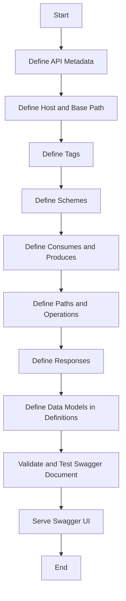

# API Documentation Process Using Swagger

## Table of Contents
1. [Flowchart](#flowchart)
2. [Steps to Create Swagger JSON](#steps-to-create-swagger-json)
    1. [Define API Metadata](#define-api-metadata)
    2. [Define Host and Base Path](#define-host-and-base-path)
    3. [Define Tags](#define-tags)
    4. [Define Schemes](#define-schemes)
    5. [Define Consumes and Produces](#define-consumes-and-produces)
    6. [Define Paths and Operations](#define-paths-and-operations)
    7. [Define Responses](#define-responses)
    8. [Define Data Models in Definitions](#define-data-models-in-definitions)
    9. [Validate and Test Swagger Document](#validate-and-test-swagger-document)
    10. [Serve Swagger UI](#serve-swagger-ui)
3. [Example using Swagger JSDoc](#example-using-swagger-jsdoc)

## Flowchart



## Steps to Create Swagger JSON

### 1. Define API Metadata
Specify the version, title, description, and license of the API.

```json
{
  "swagger": "2.0",
  "info": {
    "version": "1.0.0",
    "title": "My restaurant Project CRUD",
    "description": "My User Project Application API",
    "license": {
      "name": "MIT",
      "url": "https://opensource.org/licenses/MIT"
    }
  }
}
```

### 2. Define Host and Base Path
Set the host URL and base path for the API.

```json
{
  "host": "localhost:3000",
  "basePath": "/"
}
```

### 3. Define Tags
Categorize the API endpoints using tags.

```json
{
  "tags": [
    {
      "name": "Restaurants",
      "description": "API for users in the system"
    }
  ]
}
```

### 4. Define Schemes
Specify the supported schemes (e.g., HTTP, HTTPS).

```json
{
  "schemes": [
    "http"
  ]
}
```

### 5. Define Consumes and Produces
Indicate the content types the API can consume and produce.

```json
{
  "consumes": [
    "application/json"
  ],
  "produces": [
    "application/json"
  ]
}
```

### 6. Define Paths and Operations
Outline the API endpoints, methods, and parameters.

```json
{
  "paths": {
    "/restaurants": {
      "get": {
        "tags": [
          "Restaurants"
        ],
        "summary": "Get all restaurants",
        "description": "Get all restaurants",
        "operationId": "getRestaurants",
        "produces": [
          "application/json"
        ],
        "responses": {
          "200": {
            "description": "successful operation",
            "schema": {
              "type": "array",
              "items": {
                "$ref": "#/definitions/Restaurant"
              }
            }
          },
          "400": {
            "description": "Invalid status value"
          }
        }
      }
    }
  }
}
```

### 7. Define Responses
Specify the possible responses, including status codes and response schemas.

```json
{
  "responses": {
    "200": {
      "description": "successful operation",
      "schema": {
        "type": "array",
        "items": {
          "$ref": "#/definitions/Restaurant"
        }
      }
    },
    "400": {
      "description": "Invalid status value"
    }
  }
}
```

### 8. Define Data Models in Definitions
Create data models in the definitions section.

```json
{
  "definitions": {
    "Restaurant": {
      "required": ["id", "name"],
      "properties": {
        "id": {
          "type": "integer",
          "uniqueItems": true
        },
        "name": {
          "type": "string"
        }
      }
    }
  }
}
```

### 9. Validate and Test Swagger Document
Use tools like Swagger Editor to validate and test the document.

- Open [Swagger Editor](https://editor.swagger.io/)
- Copy and paste your Swagger JSON into the editor
- Validate and test the endpoints

### 10. Serve Swagger UI
Use `swagger-ui-express` to serve the Swagger UI for interactive API documentation.

```javascript
const swaggerJsdoc = require('swagger-jsdoc');
const swaggerUi = require('swagger-ui-express');
const express = require('express');
const app = express();

const options = {
  definition: {
    openapi: '3.0.0',
    info: {
      title: 'My restaurant Project CRUD',
      version: '1.0.0',
      description: 'My User Project Application API',
      license: {
        name: 'MIT',
        url: 'https://opensource.org/licenses/MIT',
      },
    },
    servers: [
      {
        url: 'http://localhost:3000',
      },
    ],
  },
  apis: ['./routes/*.js'], // Path to the API docs
};

const specs = swaggerJsdoc(options);
app.use('/api-docs', swaggerUi.serve, swaggerUi.setup(specs));

app.listen(3000, () => {
  console.log('Server is running on http://localhost:3000');
});
```

## Example using Swagger JSDoc

```javascript
// Required dependencies
const express = require('express');
const swaggerJsdoc = require('swagger-jsdoc');
const swaggerUi = require('swagger-ui-express');
const cors = require('cors');

// Express server setup
const app = express();
app.use(cors());
app.use(express.json());

// Swagger configuration
const swaggerOptions = {
    definition: {
        openapi: '3.0.0',
        info: {
            title: 'Restaurant API',
            version: '1.0.0',
            description: 'A simple restaurant API'
        },
        servers: [
            {
                url: 'http://localhost:3000'
            }
        ]
    },
    apis: ['./routes/*.js']
};

const swaggerSpecs = swaggerJsdoc(swaggerOptions);
app.use('/api-docs', swaggerUi.serve, swaggerUi.setup(swaggerSpecs));

/**
 * @swagger
 * /restaurants:
 *   get:
 *     summary: Returns all restaurants
 *     tags: [Restaurants]
 *     responses:
 *       200:
 *         description: List of all restaurants
 *         content:
 *           application/json:
 *             schema:
 *               type: array
 *               items:
 *                 $ref: '#/components/schemas/Restaurant'
 */
app.get('/restaurants', (req, res) => {
    res.json([
        { id: '1', name: 'Restaurant A', rating: 4.5 },
        { id: '2', name: 'Restaurant B', rating: 4.0 }
    ]);
});

/**
 * @swagger
 * components:
 *   schemas:
 *     Restaurant:
 *       type: object
 *       required:
 *         - name
 *         - rating
 *       properties:
 *         id:
 *           type: string
 *           description: Auto-generated id
 *         name:
 *           type: string
 *           description: Restaurant name
 *         rating:
 *           type: number
 *           description: Restaurant rating
 */

// Server start
const PORT = process.env.PORT || 3000;
app.listen(PORT, () => {
    console.log(`Server running on port ${PORT}`);
    console.log(`Swagger UI available at http://localhost:${PORT}/api-docs`);
});

